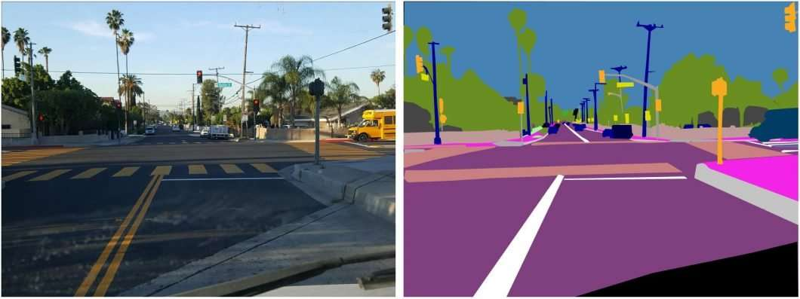
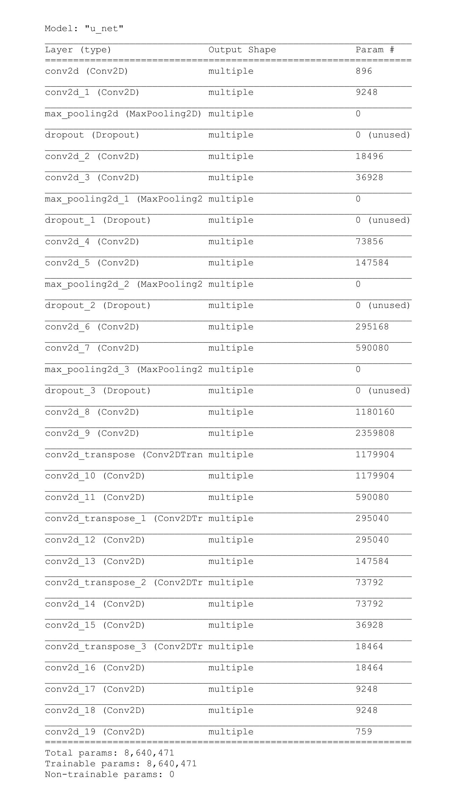

# Semantic Segmentation for Identifying Drivable Path

### Description

#### Semantic image segmentation is classifying each pixel in an image from a predefined set of classes.

This U-Net inspired architecture, classifies pixels in a given road image in 
upto 23 classes. (Road, House, Pedestrian, Vechiles, Sky, Lane Line etc.)

### Use Case
Ability to identity the surrounding in real time can provide input to 
decision-making modules of various AI robot like.
1. Self-Driving Cars
2. Accessibility Assistant
3. Geo-Sensing and Mapping

### Model Architecture

The model architecture is inspired by U-Net - 
which consists of a contracting path to capture context and a symmetric expanding path that enables precise localization.

Below is the exact model architecture

### Data set 
The whole model is trained on CARLA self-driving car dataset with 1060 images and mask.

### Training and Test Results
Training: 97% IoI
Test  91% IoU

### Commands to run

#### Training
##### New Training
`python .\src\driver.py  -t training -n True`

##### Training from previous checkpoint
`python .\src\driver.py  -t training`

##### Inference multiple images
`python .\src\driver.py  -t inference -m True -f .\data\carla\test\test_1\ -e png`

##### Inference single image
`python .\src\driver.py -t inference -i .\data\carla\test\test_1\7.png -d True -s True -e png`

